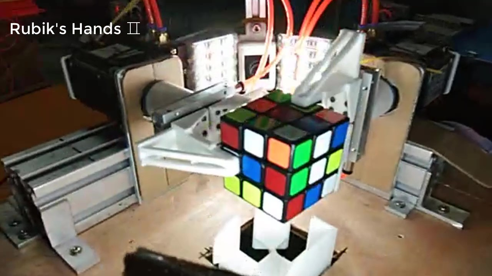

# Rubiks-Hands-2
 
### This is a software system for the robot to solve the puzzle of Rubik's Cube
　　Here we use two cameras and a robotic arm to flip the cube to achieve the color face of the cube. The method of [**Kociemba**](http://kociemba.org/) is used to solve the execution step of the Rubik's cube, and the robotic arm is solved by the underlying coordinate orientation transformation.  
　　It is a more faster solution than [**Rubik's-Hands**](https://github.com/JameScottX/Rubik-s-Hands) that I have been built before! It only takes about 10s to solve the Rubik's Cube.

*Some information of Introduction that you can find here*  
　　[**Video**](https://www.bilibili.com/video/BV1Q7411i7aJ)  
　　[**My blog**](https://blog.csdn.net/qq_37389133/article/details/95445874)  

